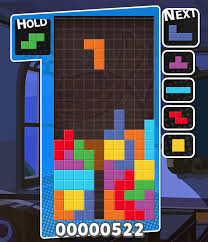
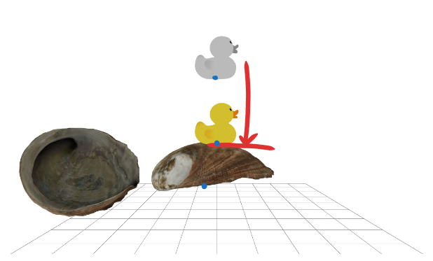

# Stacking



We wish to implement a function that stacks arbitrary GLTF models, in a manner similar to tetris.



We will trigger a function to perform a shapecast query, then use the results to update the state of the model to be dropped.

The function should do a downward shapecast from a specified X/Z position, using the duck model. Ideally the origin Y position would be `Infinity`, but using a number like 1000 is acceptable.

```js
const three = useThree()

const shapecastDown = ({
  origin: [
    x,
    y = Infinity, // this is preferable but 1000 is ok
    z
  ],
  shape
}) => {

  return {
    object, // what object we landed on
    yOffset // Y position of duck
  }
}
```

The function will return a reference or ID for the first model that the shapecast contacts, and the position of the contact.

* We are centering models using [X, Y + height/2, Z] (see blue dots).
* Models will have arbritrary rotations applied.
* We will position the duck relative to the shell position, not world coordinates, however this just needs to be possible, and does not need to be implemented.

